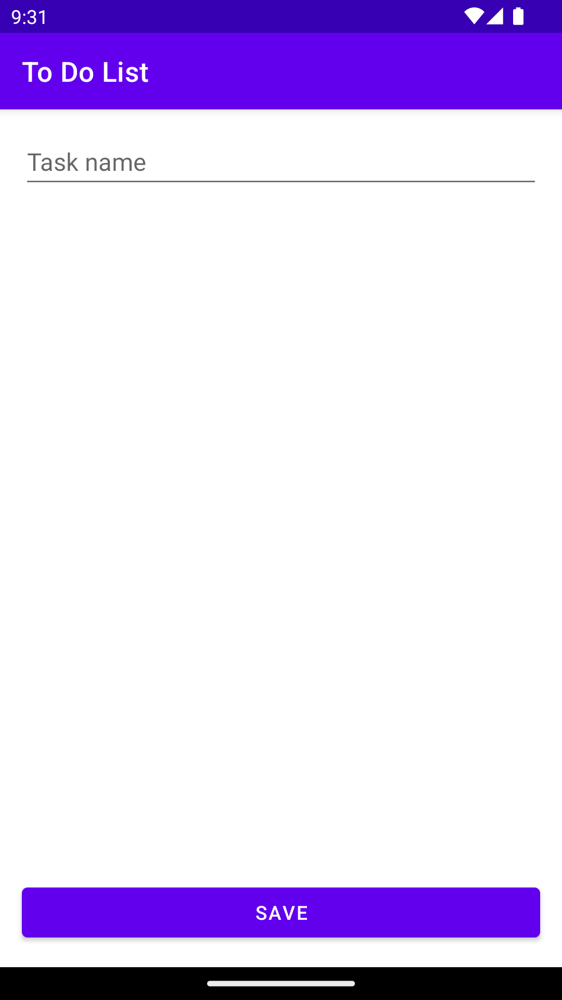
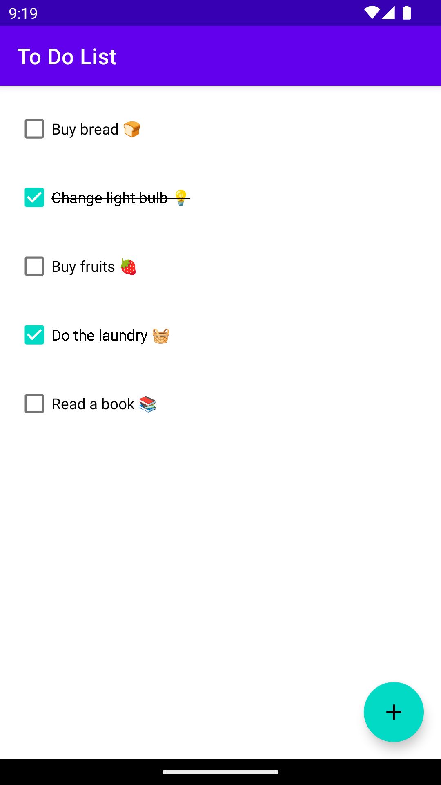

# To Do List

This is a Android with Kotlin study project where you can register and list tasks

 

## Installation

Clone this repository and import into **Android Studio**

```bash
git clone git@github.com:naabraz/ToDoList.git
```